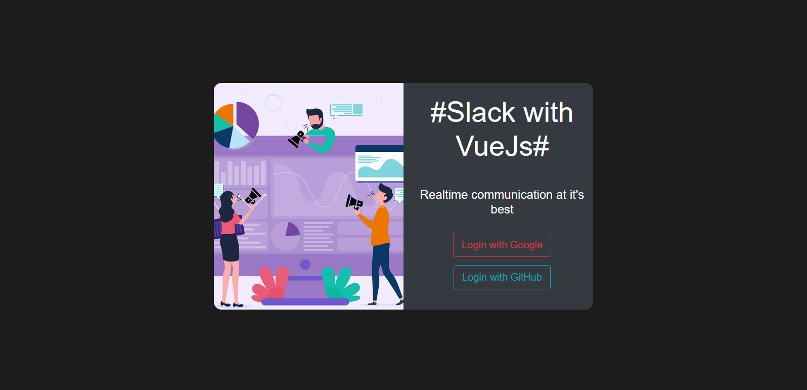
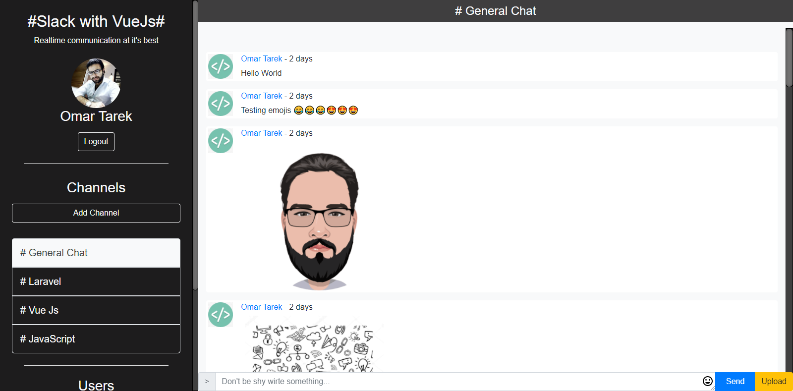
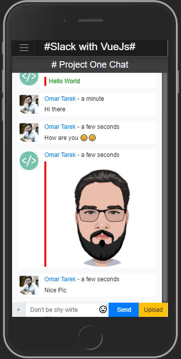
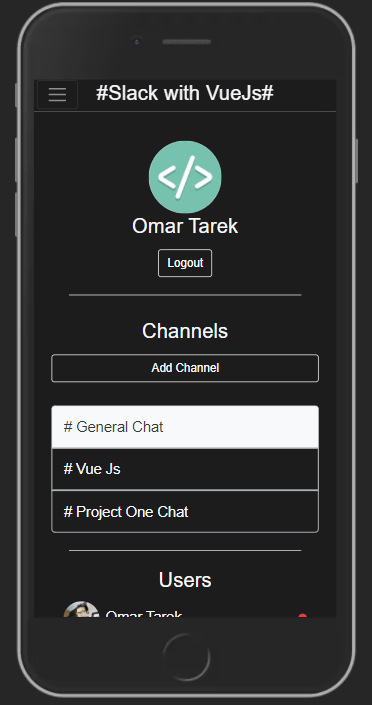

# vue-chat

<h2>A chat webapp with vue js, firebase and webpack</h2>
<br>

> ### Checkpout the [Demo from here](https://slack-with-vuejs.web.app/)

<br>

# Features

<ul>
<li>Realtime chat</li>
<li>Can Create chat channels</li>
<li>Send Images and emojis</li>
<li>Pivate messages between users</li>
<li>Online/Offline status for users</li>
<li>Message notifications</li>
<li>Full responsive</li>
</ul>

# Screenshots


<br>


<br>


<br>



# Build Setup

```bash
# install dependencies
npm install

# serve with hot reload at localhost:8080
npm run dev

# build for production with minification
npm run build

# build for production and view the bundle analyzer report
npm run build --report

# Create firebase account from
https://firebase.google.com/

# Create firebase project then add the database rules and storage rules from project files (database.rules.json - storage.rules)

# Install firebase globally
npm install -g firebase-tools

# Log into Firebase using your Google account
firebase login

#Initialize your project
firebase init

# Deploy the app on firebase
firebase deploy
```

For a detailed explanation on how things work, check out the [guide](http://vuejs-templates.github.io/webpack/), [docs for vue-loader](http://vuejs.github.io/vue-loader) and [Firebase documentation](https://firebase.google.com/docs/hosting/quickstart)
